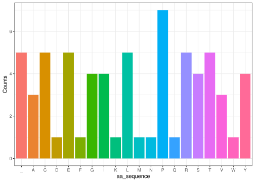

# group20

## Installation

You can install the development version of group20 from
[GitHub](https://github.com/) with:

``` r
# install.packages("devtools")
devtools::install_github("rforbiodatascience23/group_20_package")
```

``` r
library(group20)
```

## Link to github group repo

<https://github.com/rforbiodatascience23/group_20_package>

## group20 package

This package can be used to transcribe and translate any DNA sequence.
It can also be used to visualize the distribution of amino acids in a
protein. For these purposes, the package includes five functions to
describe the central dogma of molecular biology. They can be used
individually or in conjunction with each other.

More functions could be included to add other relevant features. At this
moment stop codons can be included in the codon sequence with no
consequences to the final protein sequence. A function that cuts the
amino acid sequence short in case of a stop codon could be implemented
to account for this problem. A mutator function could also be included
to automatize the effect of mutations in a saved DNA sequence.

## Functions

The gene() function creates a DNA sequence of length X by random
sampling of the four DNA nucleotides.

Transcribe_DNA() takes a DNA sequence and transcribes it into RNA by
substituting all T’s in the DNA sequence with U’s. The input for the
function is a DNA sequence, for instance created with gene(), and the
output will be the corresponding RNA sequence.

extract_codons() takes an RNA sequence as string and outputs the codons,
with a default start position at 1.

translator() takes a vector of codons and outputs an amino acid sequence
in the form of a string consisting of amino acid abbreviations.

aa_plot() takes a string of amino acids (as letter abbreviations) and
turns it into a bar chart which shows the number of occurrences of each
amino acid. The function takes the string of amino acids and makes a
vector. In this part, the str_split function from the “stringr”-package
is applied. Afterwards, the function counts the number of occurrences of
each amino acids. It makes a new data frame (called “counts”) of the
amino acid-vector plus the new vector of counts which is saved as the
column called “Counts”. This “counts”-data frame is used to make a
ggplot (from the “ggplot2”-package). The function output is a bar chart
with the amino acid letter abbreviation on the x-axis and the number of
occurrences (“Counts”) on the y-axis.

## Examples

``` r
our_favorite_gene <- gene(200)
our_favorite_gene
#> [1] "TGATTAGTTAGGATGGCTATTTAGTTATGTATAACGACGCCGTGGACGGATCGAAAACTATACGCATGTCGGTCCACGCAGGAAGGATGCGGCGGTCCACCTTCTTGCAACTGACCTATCCGCGTAGCGGGATTATATCCTGAATCAAGAGAGCTCCCCAGTATTTAATTCGTATACACAGAGCCATAGTATGAGTGTTA"
```

``` r
our_favorite_RNA <- Transcribe_DNA(our_favorite_gene)
our_favorite_RNA
#> [1] "UGAUUAGUUAGGAUGGCUAUUUAGUUAUGUAUAACGACGCCGUGGACGGAUCGAAAACUAUACGCAUGUCGGUCCACGCAGGAAGGAUGCGGCGGUCCACCUUCUUGCAACUGACCUAUCCGCGUAGCGGGAUUAUAUCCUGAAUCAAGAGAGCUCCCCAGUAUUUAAUUCGUAUACACAGAGCCAUAGUAUGAGUGUUA"
```

``` r
our_favorite_codons <- extract_codons(our_favorite_RNA)
our_favorite_codons
#>  [1] "UGA" "UUA" "GUU" "AGG" "AUG" "GCU" "AUU" "UAG" "UUA" "UGU" "AUA" "ACG"
#> [13] "ACG" "CCG" "UGG" "ACG" "GAU" "CGA" "AAA" "CUA" "UAC" "GCA" "UGU" "CGG"
#> [25] "UCC" "ACG" "CAG" "GAA" "GGA" "UGC" "GGC" "GGU" "CCA" "CCU" "UCU" "UGC"
#> [37] "AAC" "UGA" "CCU" "AUC" "CGC" "GUA" "GCG" "GGA" "UUA" "UAU" "CCU" "GAA"
#> [49] "UCA" "AGA" "GAG" "CUC" "CCC" "AGU" "AUU" "UAA" "UUC" "GUA" "UAC" "ACA"
#> [61] "GAG" "CCA" "UAG" "UAU" "GAG" "UGU"
```

``` r
our_favorite_aa <- translator(our_favorite_codons)
our_favorite_aa
#> [1] "_LVRMAI_LCITTPWTDRKLYACRSTQEGCGGPPSCN_PIRVAGLYPESRELPSI_FVYTEP_YEC"
```

``` r
aa_plot(our_favorite_aa)
```


